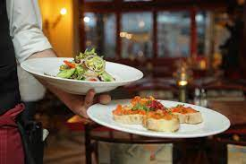

# Restaurants in Mexico Rating by Ijeoma Nwosu

---
## Introduction
This data set is called the restaurant rating dataset which contains information about restaurants in
mexico. A customer survey was carried out in this city in 2012 to collate information about each
restaurant, their cuisines, information about their consumers and the preferences of the consumers.

**The Report consists of four pages imbedded in 4 buttons on the dashboard**
1.	Consumer demographics
2.	Consumer analytics
3.	Restaurant overview
4.	Restaurant analytics

## Problem statement

**Question 1**
What can you learn from the highest rated restaurants? Do consumer preferences have an effect on
ratings?

**Question 2**
What are the consumer demographics? Does this indicate a bias in the data sample?

**Question 3**
Are there any demand & supply gaps that you can exploit in the market?

**Question 4**
If you were to invest in a restaurant, which characteristics would you be looking for?

## Data  source
https://drive.google.com/file/d/1c1HKM8UTqwWOgexRLOtEJuxjBiA2N6xf/view?usp=drive_link 

## Skills demonstrated
Data Transformation/Cleaning Data was efficiently cleaned and transformed with the Power Query Editor of Power BI.

**Some of the applied steps included DAX Concepts**
a.	**Conditional column** was used to create a new column ‘Age range’ ages of all the passengers were grouped into 10groups. 0-10, 11-20, 21-30, 31-40, 41-50, 51-60, 61-70, 71-80 and 81-90

---
b.	To replace empty cells with N/A 
________________________________________
c.	Measures in DAX was also used to calculate the total number restaurants, cuisines, consumers, average overall rating, average food rating and average service rating.

## Data Modelling
The 5 tables were connected resulting in a star schema model.

---

## Visualization 
The Report consists of four pages imbedded in 4 buttons on the dashboard
1.	Consumer demographics
2.	Consumer analytics
3.	Restaurant overview
4.	Restaurant analytics

---

---

---

---

Utilizing stacked pie charts, clustered column charts, stacked column charts and 100% stacked bar chart, for effective comparisons and trend, slicers and visual cards were also included to better functionality and better dashboard interaction These components collectively form an interactive and intuitive report, fostering enhanced comprehension and examination of the survey results. Thoughtful attention to accurate labeling, color choices, and relevant annotations ensures that the visuals are easily comprehensible for the audience.

## Insight
•	The top 3 restaurants are Tortas Locas Hipocampo, Puesto De Tacos and Caffeteria Restaurant El pacific.
•	Tortas Locas Hippocampi, the highest-rated restaurant, received high ratings for its food, services, and overall experience. 

Generally Restaurants in Mexico had an 
Average overall review of 1(satisfactory)
Average food rating of 1.22
Average service rating of 1.09

 **Customer demographics showed that age range 21-30 had the highest number of customers – 115**
•	59.4% of the customers commute via public transport
•	62.3% of the consumer population resides in San luis potosi 

•	Mexican cuisine holds top preference exerting a significant influence on restaurant due to its consistently high rating compared to other restaurants.

•	Majority of the consumers are independent, and a significant portion are students indicating bias towards certain demographics.

•	Restaurants in San Luis Potosi stands out as a key investment location in Mexico with the highest consumer percentage 62.3%.

